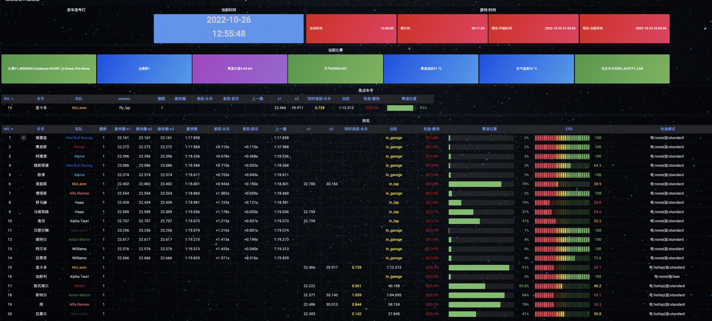
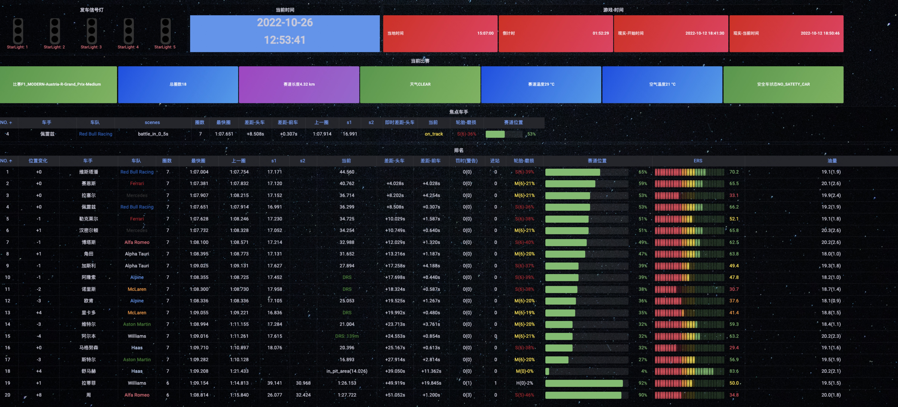

# cm-f1-tele
Codemaster series F1 games telemetry tools and system.

## complie

```
cmake .
make
```

## binary file

located in bin directory.

f1-2022-tele: telemetry program for f1 2022.

distribution-test: for searching suitable random distribution.

## dependencies

dependencies: libmysqlclient libcurl-devel

```
yum install  libcurl-devel
```

```
brew install mysql-connector-c
```

## udp -> f1-tele-2022 -> mysql-server -> auto camera

f1-2022-tele listen udp data from game ,then process and store in the mysql server.CarFocus table stored current focus car when you are specting the game. You can use python script to retrive the record, then simulate keyboard input to control camera switch autoly. 

## udp -> f1-tele-2022 -> mysql-server -> grafana->server

grafana server retrive data from mysql server, then visualization in web page.

### Qualifying


### race




